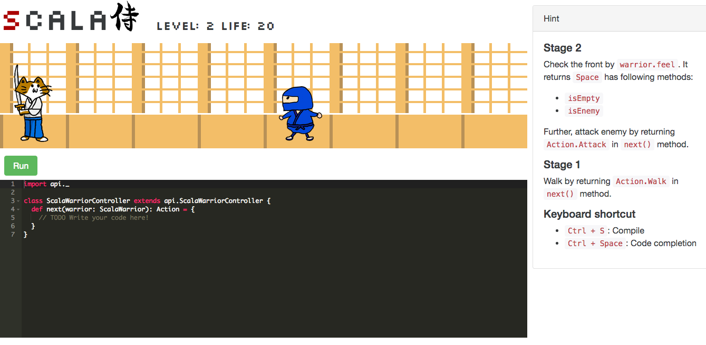

scalawarrior
=============

This is a game for learning Scala which is inspired by [ruby-warrior](https://github.com/ryanb/ruby-warrior).




Getting Started
--------

Clone this repository and hit following command at the root directory of the cloned repository to run scala-warrior:

```
./activator run
```

And access to http://localhost:9000. Let's play!

